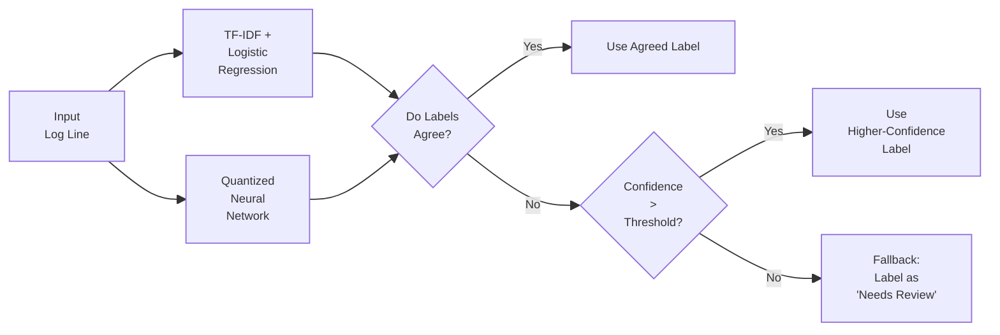

# Design Document: Fedora Security Log Triage Tool

## Overview

All the details of the system's usage are stored in the log files of the system. These log files can grow quite large in size, thereby becoming difficult for the system administrators to analyse.  Thus, this tool is built to automatically aggregate, parse and classify security-related logs on Fedora-based systems, using a hybrid combination of machine learning techniques such as TF-IDF+Logistic Regression and Quantized Neural Networks. 

---
## Objectives

- Aggregate and normalize logs from multiple local sources
- Perform classification using a hybrid ML pipeline that runs entirely offline
- Prioritize security events for quick triage
- Provide a responsive CLI interface for live monitoring or filtered export
- Package the tool as a Fedora-compliant RPM

---
## Architecture

### Components

1. **Log Collector**
	1. Monitors:
		1. `/var/log/audit/audit.log`
		2. `/var/log/secure`
		3. `journalctl` (via subprocess)
	2. Can run in polling mode or use `inotify`
	3. Output: Raw log entries

2. **Log Normalizer**
	1. Converts logs into structured JSON format
	2. Extracts fields: timestamp, source, message, PID, etc.

3. **Hybrid Classifier**
	1. **TF-IDF + Logistic Regression**: Fast, interpretable, works well on known patterns
	2. **Quantized Neural Network (TinyBERT or DistilBERT)**: For generalization and contextual understanding
	3. **Ensemble Logic**:
		1. If both models agree: accept label
		2. If they disagree: use higher-confidence result or fallback to "needs review"
		3. QNN only used when TF-IDF confidence is low (to save resources)
	4. All models are run locally, without any API calls

4. **Prioritizer**
	1. Assigns severity scores: `critical`, `warning`, `info`, `ignored`
		1. Can be threshold-based or rule-augmented

5. **CLI Interface**
	1. Realtime monitoring:
     ```bash
     logtriage --realtime
     ```
    2. Export filtered logs:
     ```bash
     logtriage --export critical --output logs.json
     ```

6. **RPM Packaging**
	 1. Fedora-compliant RPM spec file
	 2. Installs binary, model files, CLI, systemd service (optional)

---
## Log Schema Definition

Each parsed log will be converted into the following JSON format:

```json
{
  "timestamp": "2025-05-01T14:22:10Z",
  "source": "auditd",
  "message": "Failed password for root from 192.168.1.10",
  "pid": 3021,
  "classification": null,
  "confidence": null,
  "severity": null
}
```

- `timestamp`: ISO 8601 formatted log time
- `source`: Source of the log (e.g., `auditd`, `sshd`)
- `message`: Raw or cleaned-up log message
- `classification`: Predicted label (e.g., `security_critical`)
- `confidence`: Probability from classifier (0–1)
- `severity`: Final priority assigned (e.g., `critical`, `warning`)

---
## Classification Logic Diagram



---
## Fallback Mode

To ensure robustness, the tool will include a fallback mode for classification:

- If **TF-IDF classifier confidence < threshold (e.g., 0.6)**, the QNN is triggered for a second opinion.
- If **both models return low confidence**, the log is flagged as `needs_review` instead of making a forced prediction.
- This ensures the system is cautious with ambiguous or unknown patterns.
- If the **QNN model fails to load or execute** (due to missing files, corruption, etc.), the system:
  - Logs an internal error
  - Falls back to using only TF-IDF + Logistic Regression
  - Warns the user that deep classification is temporarily disabled

This design ensures graceful degradation in low-resource environments or in cases of partial failure.

---
## Tools & Stack

| Component  | Technology                                |
| ---------- | ----------------------------------------- |
| Language   | Python 3.9+                               |
| ML Models  | Scikit-learn (TF-IDF), PyTorch QNN        |
| CLI        | Click or argparse                         |
| Log Access | journalctl, audit.log, secure             |
| Packaging  | RPM spec tools, mock                      |
| Testing    | Pytest, synthetic log generator, UnitTest |

---
## Challenges

- Efficiently running a QNN on CPU in background
- Dealing with log volume and I/O limits
- Balancing recall (catching all critical logs) vs false positives
- Maintaining performance under resource-constrained environments

---
## Local Execution Model

- **No external API calls**
- ML models are bundled with the tool
- Background service (optional) can run using systemd timer or daemon mode
- Offline inference using quantized models ensures minimal CPU and RAM usage

---
## Contribution Notes

This design is proposed for GSoC 2025 and assumes a local-only, fully offline architecture. The system avoids external dependencies and is optimized for background operation on Fedora servers or endpoints. All model inference and data handling is handled on-device.
